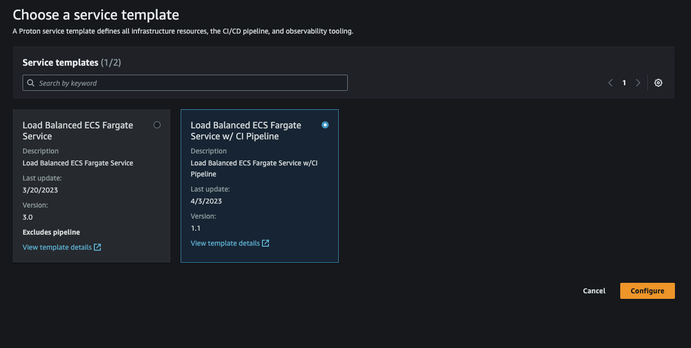
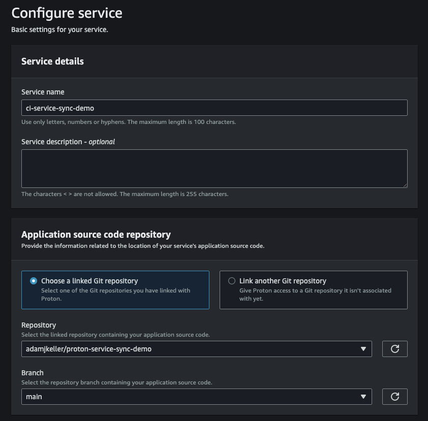
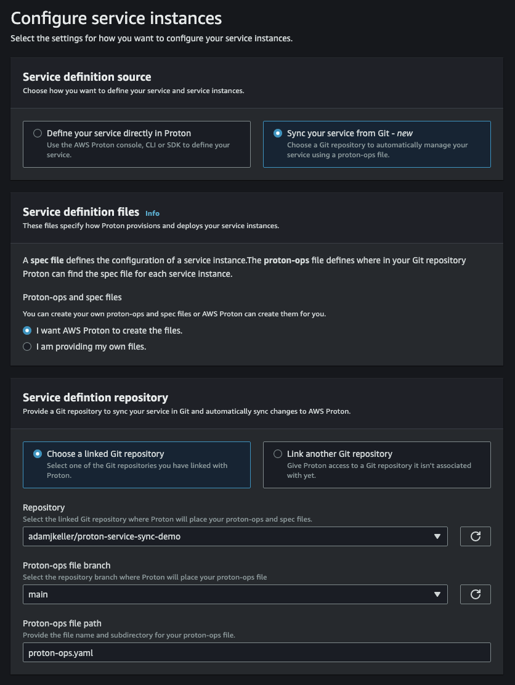
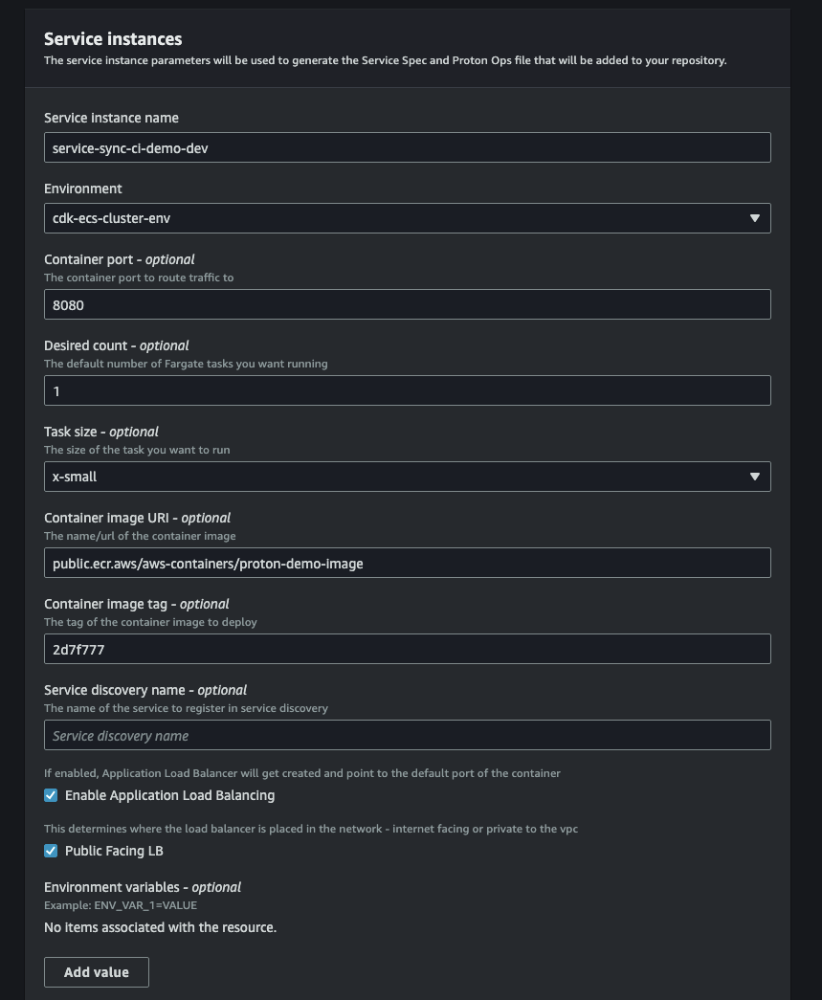
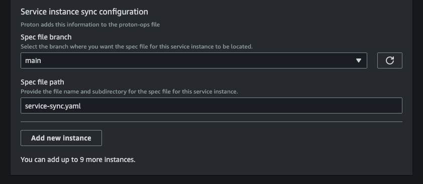
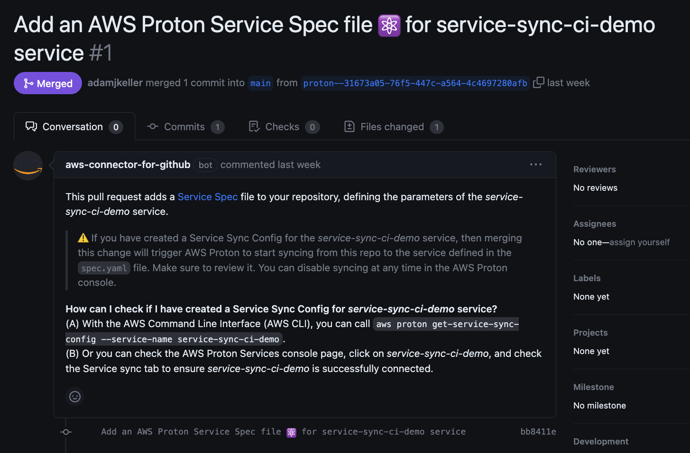
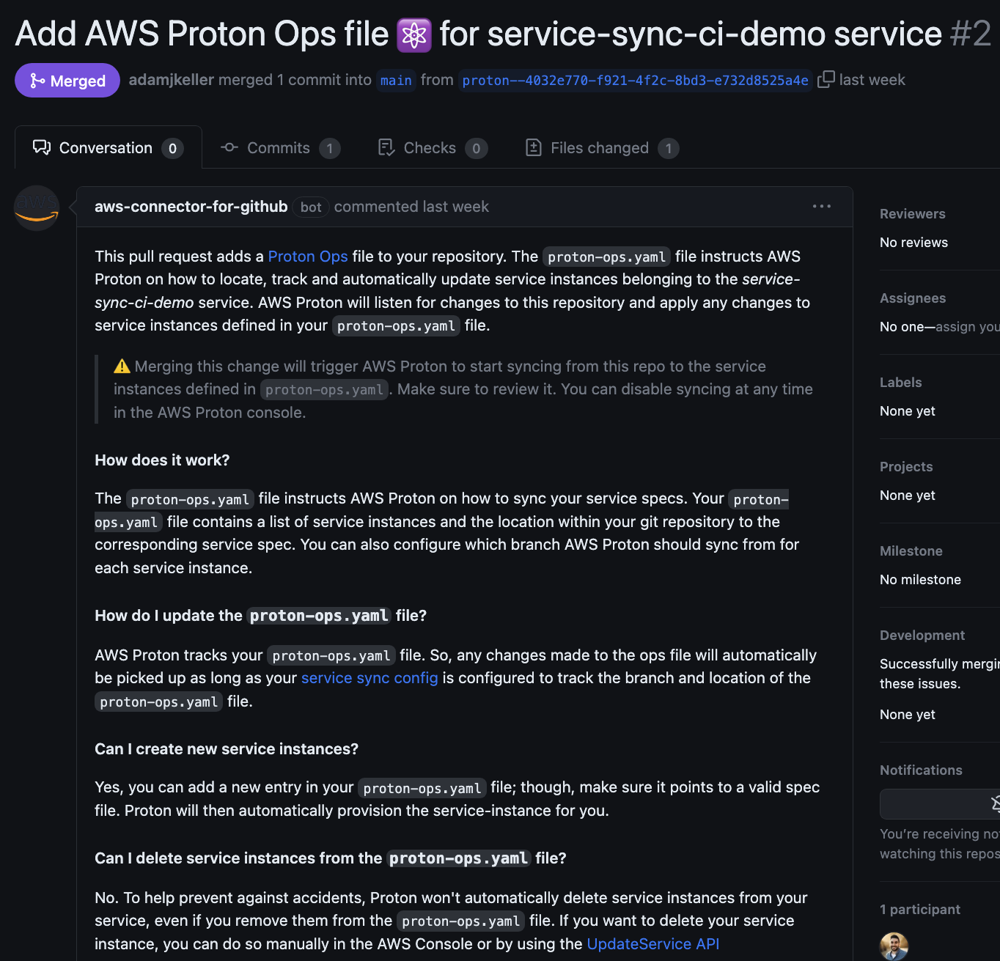
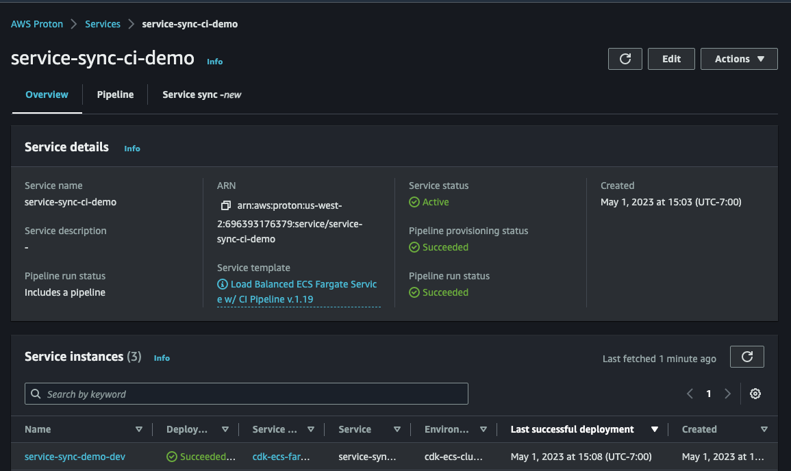
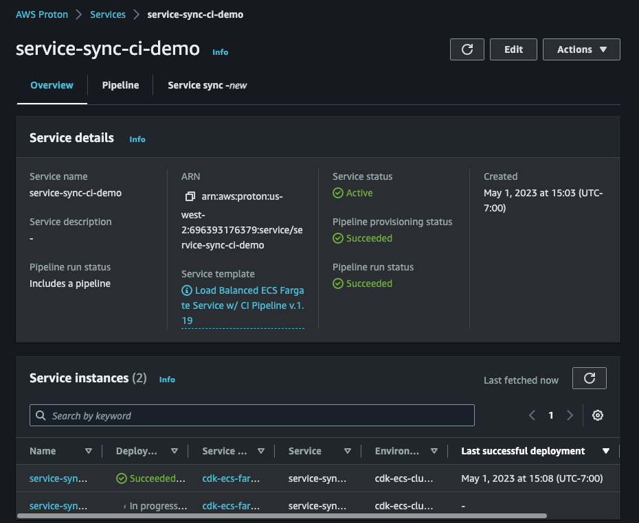

# ECS Fargate Service with CI Pipeline Template Bundle

## What this builds

This template bundle will deploy the following:

- ECS Fargate service with desired task count and compute requirements defined in the schema
- (Optional) Application Load Balancer that is attached to the ECS service
- A CI pipeline using AWS Codepipeline and AWS Codebuild for container image build automation
- Compatible with the [cdk-vpc-ecs-cluster](../../../environment-templates/cdk-vpc-ecs-cluster) environment template.

## Walkthrough

In this walkthrough we will look at how we can leverage AWS Proton to build a service template with a CI pipeline that will build and push a container image to ECR on a commit to an application git repository.
In addition, we will look at how we can leverage git as the source of truth for our service and service instance configurations by leveraging the service sync feature in Proton.

### Pre-requisites

- Deploy an environment using the [cdk-vpc-ecs-cluster](../../../environment-templates/cdk-vpc-ecs-cluster) template bundle.
- Create an S3 bucket for template bundle storage
- Create a [repository connection](https://docs.aws.amazon.com/proton/latest/userguide/ag-create-repo.html) in the Proton console.

### Step 1

- Create the service template by running the following:

```bash
make template version=1 minor_version=0 bucket=<your-bucket-name>
```

- This will create the service template in proton, version it accordingly, and publish that template for consumption.
- If you want to update the template bundle, make your changes and then when you run the make command above increase the `minor_version` value by 1.
- If you would like to connect Proton to your git repository and have template changes automatically sync on commit to a branch, check out the [template sync](https://docs.aws.amazon.com/proton/latest/userguide/ag-template-sync-configs.html) feature.

### Step 2

- Deploy a service!

- Navigate to the console, select `Services`

- Select the service template called `Load Balanced ECS Fargate Service w/CI Pipeline`



- Configure the service and select (or add) a repository for where your application code and Docker image reside.

- If you are looking for an example repository to work with, check out and fork the [proton-service-sync-demo](https://github.com/adamjkeller/proton-service-sync-demo) repo.



- Next, you can choose how you want to manage the deployment of service instances.
  For this walkthrough, we will choose service sync and use the application repo as the place to store the configurations for our service and service instances.
  - Choose `Sync your service from Git`
  - Select `I want AWS Proton to create the files`
  - Select the repository where Proton will monitor to trigger deployments for your service.



- In this example, let's couple the desired state of our service instances to the same repo where our application code lives. This way, we can have a single source of truth for our application and the infrastructure that runs it.

- Next, we will configure the service instance. For this example, we will use the environment that we deployed using the `cdk-vpc-ecs-cluster` template bundle.
  In this case, we can stick with the defaults as the default image, port and other inputs are already configured to work for a demonstration, out of the box.



- The above inputs are how we as the end user can deploy our application code and have some configurability around the resources being provisioned. For example, if we wanted to change the port that our application listens on, we can do that here without having to configure any infrastructure as code.

- Next we will configure HOW proton will monitor our desired state of our service instances in git.
  We need to define the branch as well as the path and filename for where the spec file for the above service instance configuration will live.



- We could add more service instances here in the console, but at this point I'd like to just stick with the one instance, and then deploy the rest using the configuration files in my git repository.

- The last thing we need to do is configure the CI pipeline to build the container image based on the Dockerfile location as well as add any unit test commands that we would want to run in the pipeline.

- Click Next.
  At this point you will see a summary of the service template and the service instance configuration, as well as the service sync spec files that Proton will submit to your repository via pull requests.

- Once you're done reviewing the changes, click `Create`.

### Step 3

- Navigate to your git repository and you will see two pull requests with the service sync spec files that Proton will use to deploy your service instances.
  Within the pull request, Proton includes some information about the spec files to give some context as to what each file is for.




- Merge the pull requests and Proton will begin deploying your service instances.

### Step 4

- Head back to the AWS Console and navigate to the Proton service that you created in Step 2.
  At this point you should see your service instances being deployed!
  Once it's completed, you should see this in the console.



Success! We have now deployed a service template with a CI pipeline that will build and push a container image to ECR on a commit to my application's git repository. In addition, we have leveraged git as the source of truth for our service and service instance configurations by leveraging the service sync feature in Proton.

### Modify the spec and proton-ops files

- Let's add a new service instance.
  To do this, we will update the proton-ops and service-sync files.

### Update the proton-ops file

- The purpose of the proton-ops file is to track the service instance sync configurations. ie, what branch and where is the spec file.

```
sync:
  services:
    service-sync-ci-demo:
      service-sync-demo-dev:
        branch: main
        spec: service-sync.yaml
```

- In this case, we will add a new service instance called `service-sync-demo-prod` and point it to the `main` branch.
  The proton-ops file should now look like this:

```
sync:
  services:
    service-sync-ci-demo:
      service-sync-demo-dev:
        branch: main
        spec: service-sync.yaml
      service-sync-demo-prod:
        branch: main
        spec: service-sync.yaml
```

- Next, we'll update the service-sync.yaml file to include the new service instance, `service-sync-demo-prod`.

```
proton: ServiceSpec
instances:
  - name: service-sync-demo-dev
    environment: cdk-ecs-cluster-env
    spec:
      port: 8080
      desired_count: 1
      task_size: small
      image: public.ecr.aws/aws-containers/proton-demo-image
      imageTag: latest
      load_balanced: true
      load_balanced_public: true
  - name: service-sync-demo-prod
    environment: cdk-ecs-cluster-env
    spec:
      port: 8080
      desired_count: 1
      task_size: medium
      image: public.ecr.aws/aws-containers/proton-demo-image
      imageTag: latest
      load_balanced: true
      load_balanced_public: true
```

- Commit the files and head back to the proton console. In a matter of moments you will see the new service instance being created.



- That's it! You have now added a new service instance to your service and Proton will deploy it for you.

### Cleanup

- To clean up the resources created by this walkthrough, navigate to the proton console and find the service (`service-sync-ci-demo`) in the services list.
- Click on the service and then click `Actions` --> `Delete`.
- Once the service is deleted, assuming no other services were deployed to the environment, navigate to the envirtment list and find the environment you created.
- Click on the environment and then click `Actions` --> `Delete`.

## Testing

To deploy this locally you will need the `proton-inputs.json` file (examples located in the `instance_infrastructure` and `pipeline_infrastructure` directories).
Modify the proton-inputs.json file with the proper values from an existing environment.
It's recommended that you deploy the [cdk-vpc-ecs-cluster](../../../environment-templates/cdk-vpc-ecs-cluster) environment and use the values from there to fill in the proton-inputs.json.
For the service map, you can leave or modify values as needed.
