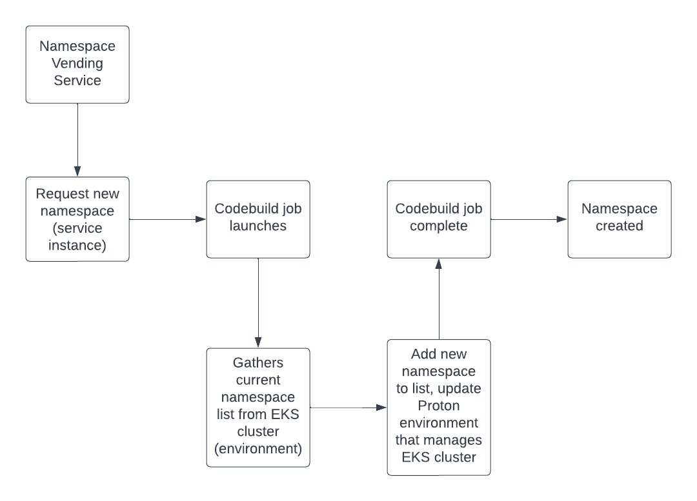
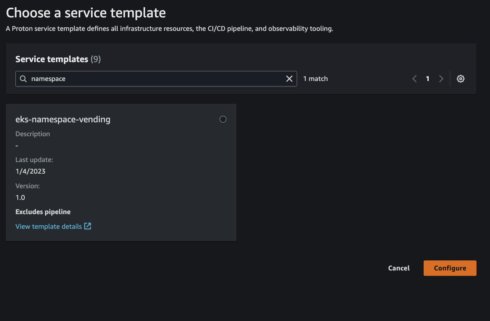
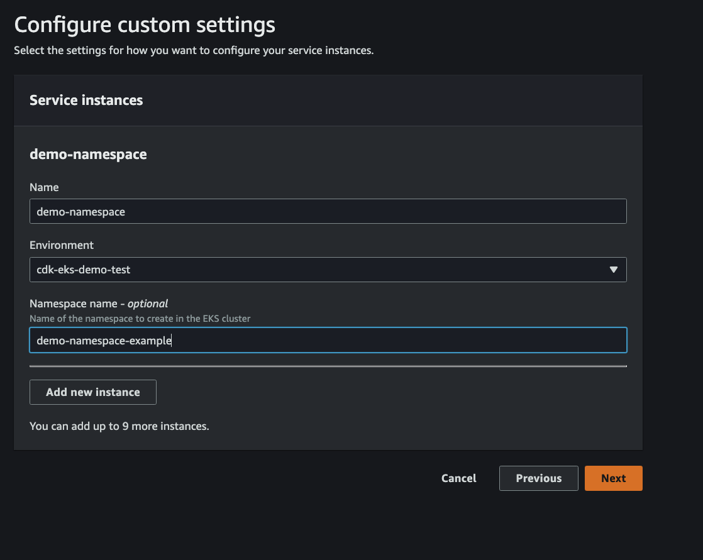

# EKS Namespace Vending Machine

### What is the purpose of this template?

The purpose of this template is to provide a self service mechanism to provide namespaces for EKS clusters that are deployed as Proton environments.

### How it works



The namespace vending machine is created as a Proton service, which in turn can create namespaces as service instances.

### Walkthrough

This service depends on EKS clusters being provisioned via AWS Proton as an environment.
Use the following [template](../../environment-templates/vpc-eks-cluster) to deploy an EKS cluster as a Proton environment.
Once this step is completed, you can now create a namespace vending machine.

1. Create a proton service. Navigate to You can do this via the console, or simply run the following commands:

```bash
BUCKET="replace-this-with-bucket-name"
REGION="region-here"
# Change the major version every time you make a change to the schema file
MAJOR_VER=1
# Change the minor version every time you make a change to the template
MINOR_VER=0
```

```bash
# Prepare the template bundle artifact and push to S3
cd v1/instance_infrastructure && tar -zcvf ../../eks-ns-vending-svc.tar.gz . && cd ../../
aws s3 cp eks-ns-vending-svc.tar.gz s3://${BUCKET}/
# Create the service template and register with Proton
aws proton create-service-template  --region ${REGION} --name eks-namespace-vending --pipeline-provisioning CUSTOMER_MANAGED
aws proton create-service-template-version --region ${REGION} --template-name eks-namespace-vending --source s3="{bucket=$BUCKET,key=eks-ns-vending-svc.tar.gz}" --compatible-environment-templates majorVersion=1,templateName=vpc-eks-cluster
# Wait for template registration to complete, then publish this version of the template bundle
aws proton wait environment-template-version-registered --region ${REGION} --major-version $MAJOR_VER --minor-version $MINOR_VER --template-name eks-namespace-vending
aws proton update-service-template-version --region ${REGION} --template-name eks-namespace-vending --major-version $MAJOR_VER --minor-version $MINOR_VER --status PUBLISHED
```

2. Navigate to the Proton console, select Services -> Create service. Find the new template we created by searching for the template name "eks-namespace-vending". Select that template, and click configure.



3. Name your service and create a service instance. When creating the service instance you will name the "instance", select the cluster you want to deploy the namespace onto, and finally the namespace name itself.



4. That's it! Proton will provision the namespace onto the EKS cluster and when it's done you can validate against the EKS cluster to confirm.

```bash
kubectl get ns
```
