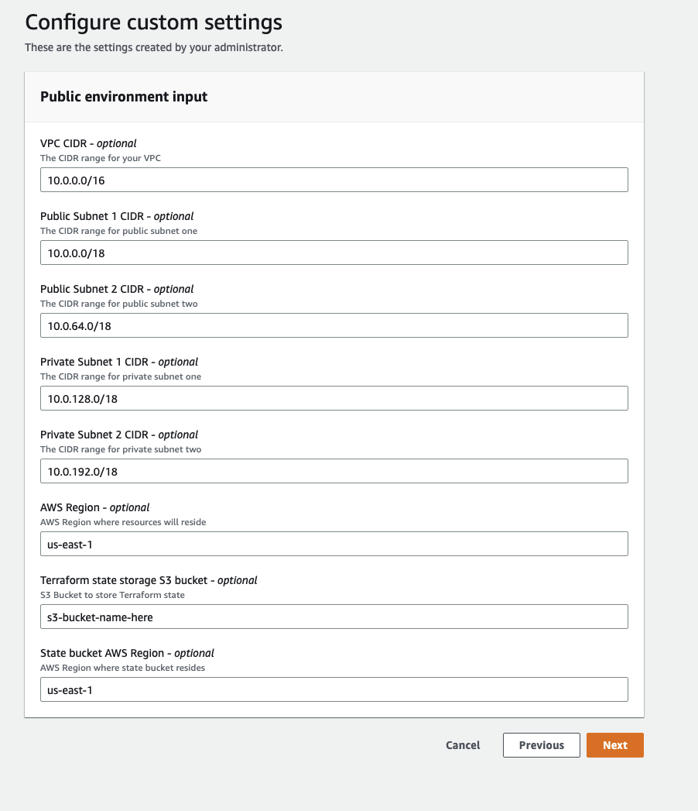

## Description

This template creates a VPC with two public and private subnets across two availability zones. The VPC includes an Internet Gateway and a managed NAT Gateway in each public subnet as well as VPC Route Tables that allow for communication between the public and private subnets.

It also deploys an ECS cluster to group your fargate tasks and services. An ECS task execution role is created to allow tasks to pull container images from an ECR private repository, and send container logs to CloudWatch Logs.

Note that this template creates its own S3 bucket to be used for storing Terraform remote state. The bucket is outputted so that associated Proton service templates can use it as well.  In this way, the IaC state for each environment instance along with its related services are all stored in a single bucket.


## Register Template in AWS Proton

To register this template in AWS Proton, you can either use the GUI console, or you can run the `make template` command specifying an S3 bucket used to store the template bundle and the version you'd like to register.

Note that you can also setup [Template Sync](https://docs.aws.amazon.com/proton/latest/userguide/ag-template-sync-configs.html) so that each commit is automatically registered in Proton.

```sh
cd terraform/environment-templates/tf-vpc-ecs-cluster
make template bucket=my-bucket version=1
```

## Input Parameters


