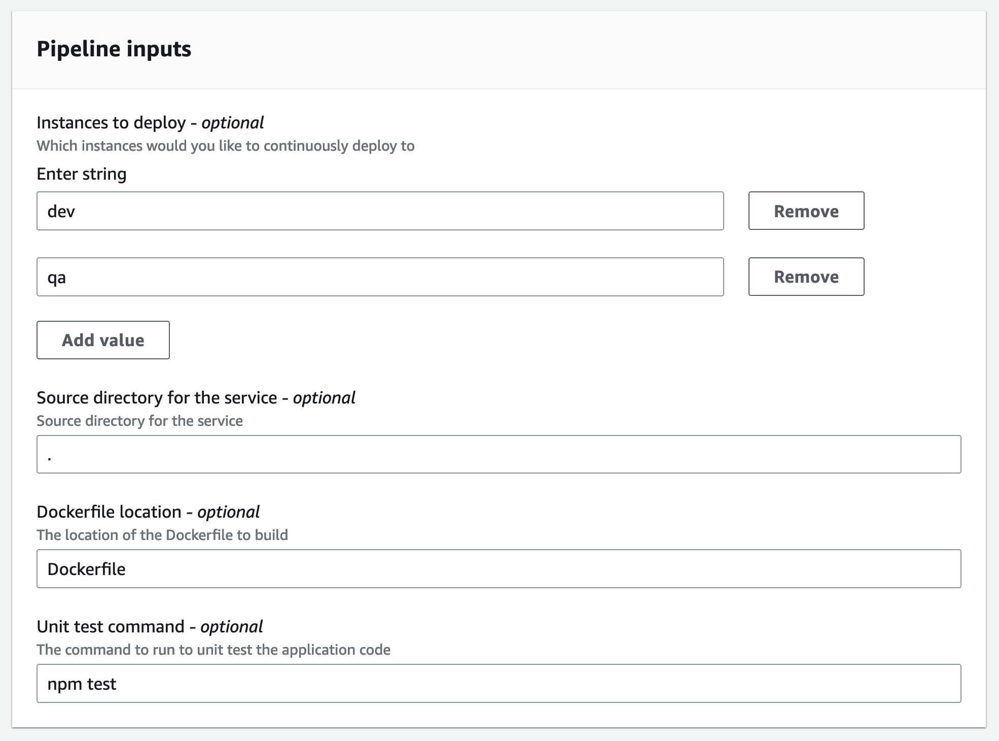

## Description

This template is the same as the [tf-ecs-fargate-lb-service](../../tf-ecs-fargate-lb-service/) but adds infrastructure to enable CI/CD using AWS CodePipeline.  The template outputs the following resources:

- Private ECR repository
- CodeBuild Project
- CodePipeline

The idea with this template is that once you deploy it, it will setup a CodePipeline that will automatically:

- build your code into a container image (requires a Dockerfile)
- push your image to ECR
- optionally deploy the new image to whichever service instances you've configured

This template is compatible with the [tf-vpc-ecs-cluster](../../environment-templates/tf-vpc-ecs-cluster) template.


## Register Template in AWS Proton

To register this template in AWS Proton, you can either use the GUI console, or you can run the `make template` command specifying an S3 bucket used to store the template bundle and the version you'd like to register.

```sh
cd terraform/service-templates/tf-ecs-fargate-lb-service-cicd-codepipeline
make template bucket=my-bucket version=1
```

### Input Parameters




### Demo

Here's a quick demo of what this looks like.


## Security

See [CONTRIBUTING](../../CONTRIBUTING.md#security-issue-notifications) for more information.

## License

This library is licensed under the MIT-0 License. See the [LICENSE](../../LICENSE) file.
