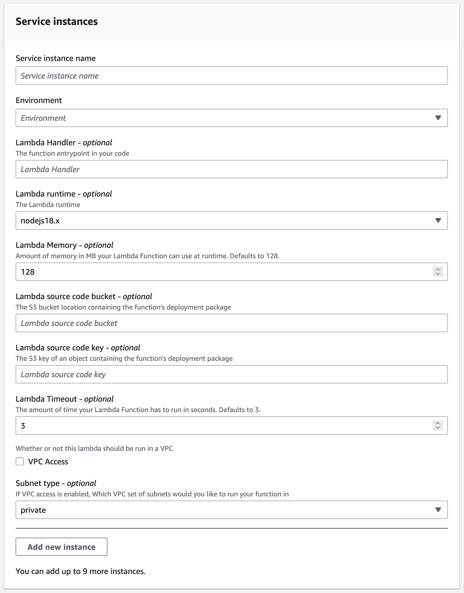

## Description

This template creates a web API stack using API Gateway HTTP API and Lambda. It's compatible with the [vpc-ecs-cluster](../../environment-templates/vpc-ecs-cluster/README.md) template.

By default, the lambda function will not be connected to a VPC.  If you want the lambda to be able to access other resources inside a VPC, you can set the `VPC Access` input property to `true` and then select the `subnet type`.  The actual subnet and security group values will come from the associated proton environment.

The template will deploy a default function (written in node.js) regardless of what you set `lambda_runtime` and `lambda_handler` to. To deploy your app, upload your deployment package zip file to an S3 bucket, and update the service by specifying the `s3_bucket` and `s3_key` input fields.


## Register Template in AWS Proton

To register this template in AWS Proton, you can either use the GUI console, or you can run the `make template` command specifying an S3 bucket used to store the template bundle and the version you'd like to register.

```sh
cd terraform/service-templates/tf-lambda-apigw-service/v1
make template bucket=my-bucket version=1
```

### Input Parameters



## Security

See [CONTRIBUTING](../../CONTRIBUTING.md#security-issue-notifications) for more information.

## License

This library is licensed under the MIT-0 License. See the [LICENSE](../../LICENSE) file.
